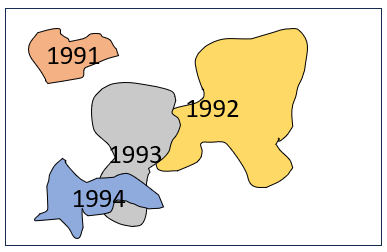
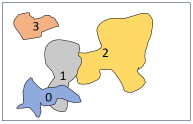
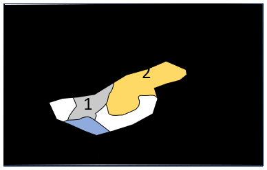
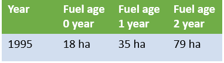

# PB-Effectiveness

This repository contains code that constructs fuel age matrices from the 
Department of Biodiversity, Conservation and Attractions Fire History dataset (DBCA_060). 
DBCA_060 is freely available from [data WA
link](https://catalogue.data.wa.gov.au/dataset/dbca-fire-history).

## Requirements

- All code is written in R. You will need R (version > 4.0) to run the code.

- You will need to have downloaded the DBCA_060 locally to your computer. **NOTE** 
The data is periodically updated so it always pays to refresh your copy of DBCA_060.

- A shapefile of your area of interest (AOI).

## The Basic Process

- The spatial extent of your AOI will be used to extract historical fire vectors 
from DBCA_060.

- The vector data is rasterised and various annual raster products are made. These 
annual (YYYY) products include:
  * `byYYYY`    - raster fire scars that occured in that year with cell values of that year.
  * `yobYYYY`   - raster fire scars that occured in that year and all preceding years, with 
  rasters overlying each other with most recent year on top.
  * `tsfYYYY`   - current year minus yobYYYY for current year producing raster with cell 
  values of time since fire (or year since last burn).
  * `wfmYYYY`   - wild fire raster mask for that year. Wild fires are subset from 
  DBCA_060 by vector attribute.
  * `ofmYYYY`   - other fire mask for that year. All fires not attributed as wild fire 
  from DBCA_060.
  * `wffaYYYY`  - tsfYYYY masked by wfmYYYY that produces the wild fire fuel age raster 
  for that year.
  * `offaYYYY`  - tsfYYYY masked by ofmYYYY that produces the other fire fuel age raster 
  for that year.

- Area stats are then calculated by multiplying the pixel count of unique fuel ages 
by the pixel resolution and exported as csv.

## The YOB to TSF to Fuel Age process in more detail

If you were to look at all of the fire scar data from the 1991 to the 1994 
in your AOI it might look like the below. To arrive at this we have stacked the 
burn year data (byYYYY) on top of each other. This is the year of burn (yobYYYY) 
data.

  

If you then subtracted the year of burn data from 1994 you would get the below, which 
is the time since fire (tsfYYYY) or also known as year since last burn.

Next you can construct a fire mask (all, wild fire or other) for 1995 and use it to 
crop the time since fire for 1994. This will result in a classified raster that 
has the fuel ages that the wild fire in 1995 burnt across. Something like below.

The last process is to extract the count of pixels for each of the remaining fuel 
ages and convert them to area.

